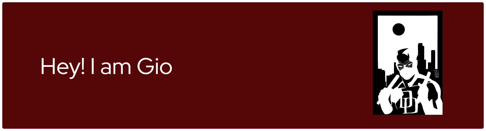

  

<h1 align="center" style="color:#701705;">Hi, I'm Giorgia </h1>
<h3 align="center" style="color:#B0B0B0;">Astrophysics & Cosmology Student</h3>

  
  

---

### About me

- 🎓 Bachelor’s degree in **Astronomy** — *University of Bologna*  
- 📚 Master’s student in **Astrophysics and Cosmology** — *University of Bologna*
- 📚 Bachelor's student in **Aerospace Engineering** - *University of Bologna*
- ✈️ Currently **Erasmus student** at the **University of Potsdam**  

---

### 🌌 Research Interests

-Galaxies
- Numerical simulations  
- Stellar evolution  
- Compact objects & relativistic astrophysics  
- Scientific computing  

---

### 🛠️ Languages & Tools

---

### 🕯️

> *Aah, you were at my side, all along.,  
> My true mentor... My guiding moonlight...*

---

### 📫 Contact

- 📧 Email: giorgia.tiozzo4998@gmail.com

